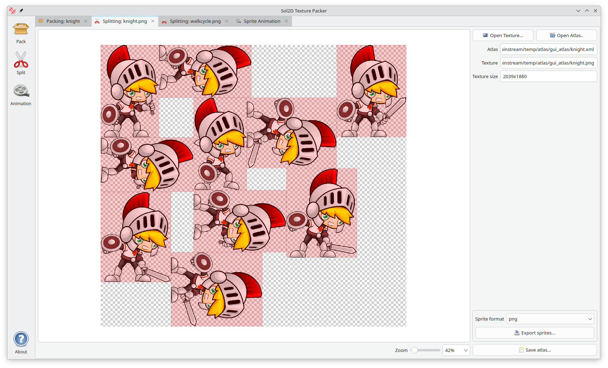
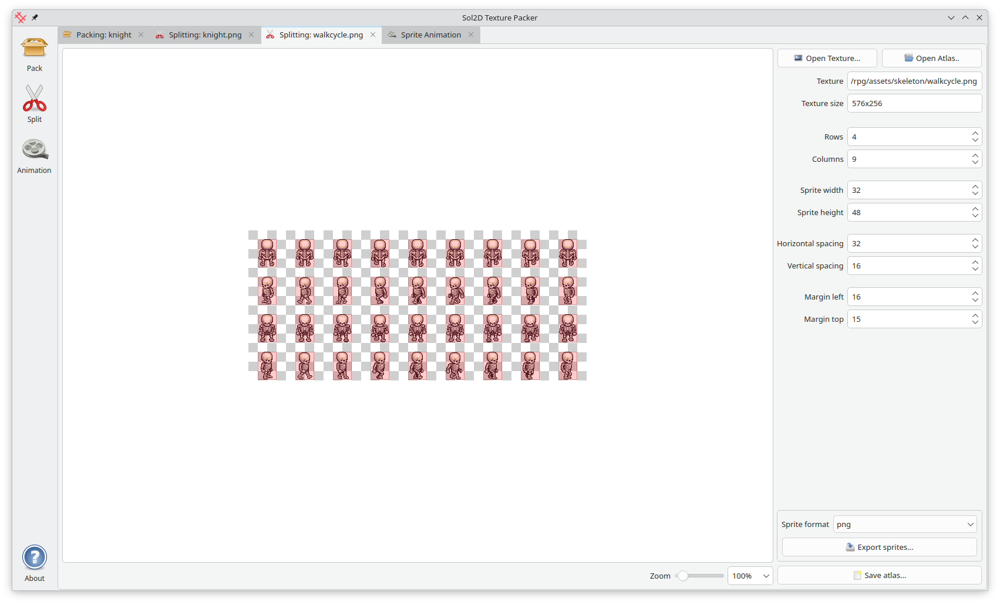
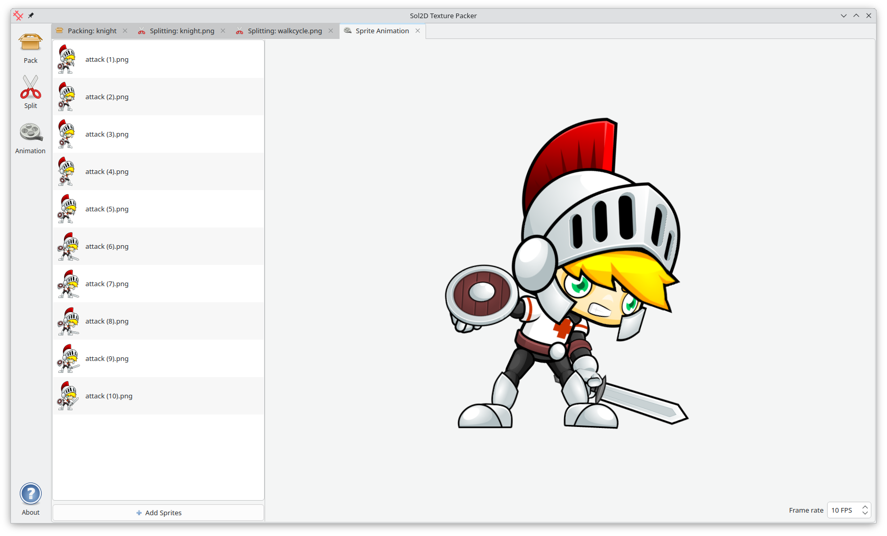

# Sol2D Texture Packer

## GUI

### Packing sprites into a set of atlases

### Unpacking atlases

### Unpacking grids

### Animate sprites

## CLI

There is a CLI application that allows you to pack and unpack atlases.
